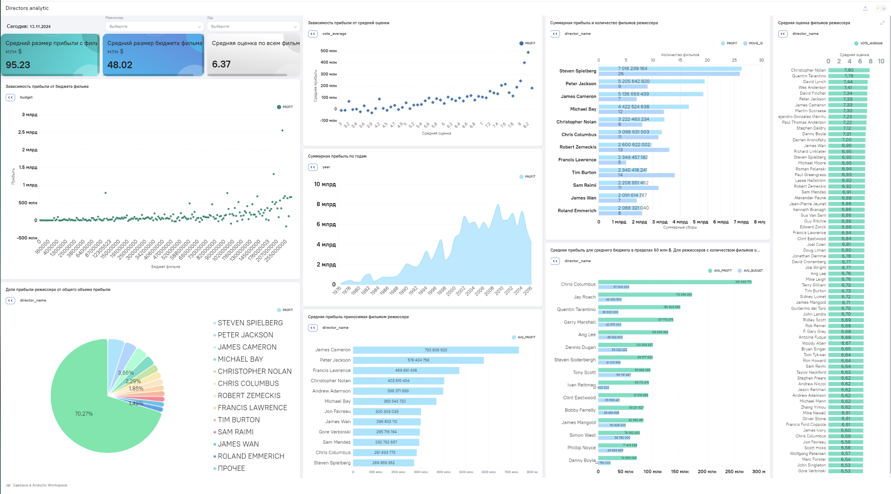

# Анализ данных по кассовым сборам режиссеров художественных фильмов. SQL, pyspark, BI.

## Ссылка на дашборд:
https://aw-demo.ru/public/dashboard/-RN2poaBK1FvDZ9UxuqV0aK4-Su-mHrX 

## История
Заказчиком является некая иностранная компания, обладающая свободным капиталом в размере 55-60 млн. $  и желающая его вложить в производство художественного фильма с целью извлечения прибыли.   
Для обеспечения прибыльности будущего фильма было решено основную ставку сделать на выбор режиссера. По мнению Заказчика именно грамотный выбор режиссера обеспечит общий успех задуманного.   
Перед нами поставлена задача проанализировать  набор данных, содержащий большое количество фильмов, режиссеров этих фильмов, их коммерческие показатели, оценки зрителей, год выхода и т.д.  

## Реализация
Все действия выполнялись в  BI-системе Analytic Workspace (AW BI). Это Российская BI-система, обладающая гибким функционалом, позволяющая  внутри себя выполнять, обработку данных с 
помощью SQL и pyspark-скриптов, использующая в качестве оркестратора ETL- Apache Airflow  

За основу был взят датасет с Kaggle (https://www.kaggle.com/datasets/nayanack/movies-and-directors-dataset-for-film-analytics). В его основе 2 файла CSV, которые и были импортированы в качестве источников.  
На дашборде размещены следующие виджеты:   
1. кастомный с текущей датой.  
2. статические виджеты типа "Тренд" постоянно и неизменно выводящие на экран средний бюджет, прибыль и оценку зрителей по всем фильмам датасета. Это сделано для наглядности в качестве ориентира  
    при работе с остальными виджетами, завязанными на системные фильтры "Режиссер" и "Год".   
3. Виджеты зависимостей прибыли от бюджета и от средней оценки фильма ( аналоги графиков scatterplot).   
4. Виджет, показывающий сколько прибыли зарабатывали фильмы  в тот или иной год.  
5. Набор виджетов с данными по режиссерам. Прибыли, бюджеты, количество и оценки их фильмов.  

## Выводы
Глядя на наш дашборд делаем следующие выводы ( читаем его слева-направо, сверху-вниз):  
- размер прибыли имеет слабую линейную зависимость от размера бюджета.   
- размер прибыли имеет более выраженную линейную зависимость от величины оценки фильма. Провалившиеся в прокате фильмы имеют низкие оценки. Фильмы со средними и высокими оценками себя окупают.  
- видим, что в целом что в 21 веке фильмы приносят суммарно больше дохода, чем в прежние десятилетия. Т.е. есть некоторый долгоиграющий тренд на общую прибыльность киноиндустрии.  

Далее переходим, наконец к виджетам с фамилиями режиссеров, среди которых мы и будет выбирать оптимальный вариант.  
- смотрим на режиссеров-лидеров по общей суммарной прибыли за их карьеру, учитывая при этом количество фильмов, участвующих в рейтинге. Видим, что хоть Спилберг  
  и является лидером по абсолютной прибыли, но снял почти в 3 раза больше фильмов, чем идущий на втором месте Питер Джексон.  
-  дальше смотрим на круговую диаграмму, показывающую процентный вклад режиссеров общую сумму прибыли по индустрии
- переходим к рейтингу режиссеров по средней прибыли за каждый фильм. Тут у нас лидеры Кэмерон и Джексон,  но мы знаем что они специалисты по дорогостоящим блокбастером, а наш бюджет ограничивает 60 млн.  
- поэтому мы переходим по сути к главному виджеты нашего дашборда,  на который выведен рейтинг режиссеров по средней прибыли с фильма с привязкой к размеру его среднего бюджета (не более 60 млн $). И тут у нас есть явный лидер - Крис Коламбус.  

При среднем бюджете своих фильмов в 57 млн, он обеспечивал  среднюю прибыльность в 281 млн.  

Смотрим на статичные виджеты в левом верхнем углу и видим, что при среднем бюджете фильма не сильно большем, чем в среднем по индустрии ( 48 млн), Крис  в среднем обеспечивает почти в 3 раза больше прибыли,  
которая составляем 95 млн. в целом по всем режиссерам.  

Осталось посмотреть рейтинг средних оценок фильмов по режиссерам т.к. нам важно чтобы наш режиссер имел оценки не ниже средней ( выведенной в левом верхнем углу). Строим рейтинг 70-ти лучших и видим в нем ближе  
к низу искомого Криса Коламбуса со средней оценкой 6,59. Это выше общего среднего в 6,37 , что нас устраивает.  
Конечно, могло бы быть и повыше, но для нас на первом месте всё-таки стоит прибыльность за наш бюджет, а не желание понравиться зрителю.  

Далее проверяем что Крис Коламбус находится в добром здравии и не собирается уходить на пенсию и рекомендуем его Заказчику в качестве приоритетной кандидатуры.  

## Как строился дашборд (Технические нюансы).  

Моделей данных было сделано 3. Две из них тесно связаны с помощью настроенных связей. Третья используется отдельно чисто для 3-х статических виджетов-трендов.   
Первая модель построена с помощью обычного SQL и джойнов. Вторая сделана на базе декоратора, написанного на Pyspark Dataframe в ETL-редакторе. Третья на базе SQL с использованием оконных функций.  
Был сделан простейший кастомный виджет с использованием html и js.  
Также сделаны 2 системных фильтра по режиссерам и по годам выпуска фильмов, позволяющие посмотреть статистику по отдельному режиссеру или по годам, как отдельно, так  и по группе годов ( множественная выборка).   

## Технологический стек:
SQL, Pyspark, Airflow, BI-система Analytic Workspace  

## Файлы и папки в репозитории:
directors.csv - файл с исходными данными по режиссерам фильмов.  
movies.csv - файл с исходными данными по художественным фильмам.  

 
